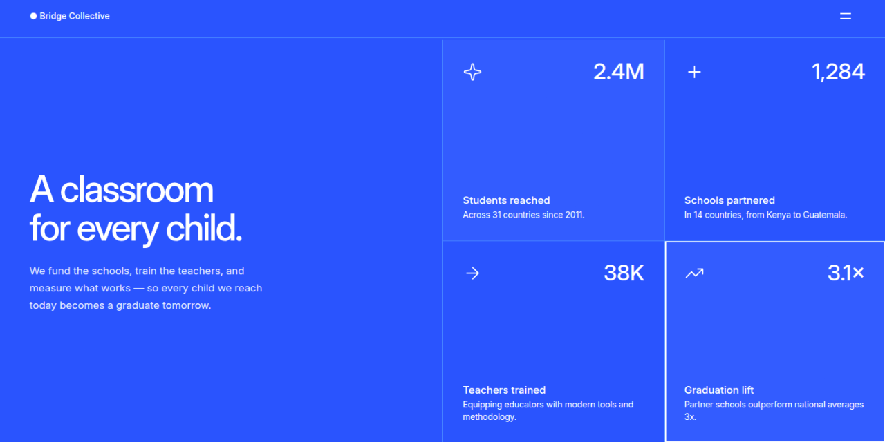
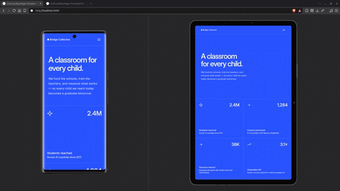

# Grid Landing Page





A Frontend Mentor challenge implemented as a small, production-minded front-end project focused on semantic HTML, responsive CSS, accessible navigation, and modular JavaScript.

---

## Links

- [**Live Preview**](https://vimpdev.github.io/fem-htmlcss-newbie-20-grid-landing-page/)
<!-- - [**Frontend Mentor Solution**]() -->

---

## Demo



---

## Screenshots

### Mobile

| Default | Menu |
| --- | --- |
|  |  |

### Tablet


| Default | Menu |
| --- | --- |
|  |  |

### Desktop


| Default | Menu |
| --- | --- |
|  |  |
| Interaction states | Menu interaction |
|  |  |

---


## Highlights

- Mobile-first responsive layout using CSS Grid and Flexbox.
- Semantic HTML with an accessible document structure.
- Keyboard-accessible navigation using `aria-expanded`, `aria-label`, `Escape`, focus restoration, and `inert`.
- JSON-driven statistics rendered dynamically with JavaScript.
- Native ES modules with separate responsibilities for menu and statistics.
- Hover and `:focus-visible` states for interactive elements.
- Reduced-motion support with `prefers-reduced-motion`.
- CSS architecture built with Cascade Layers, custom properties, and native CSS Nesting.
- Logical CSS properties and responsive typography with `clamp()` and `text-wrap: balance`.

---

## Technical Decisions

### CSS architecture

The stylesheet is organized with Cascade Layers:

```css
@layer reset, fonts, tokens, base, layout, components, utilities, responsive, states;
```

Design tokens separate raw values from semantic usage, for example:

```css
--color-blue-700: ...;
--color-bg-main: var(--color-blue-700);
```

Reusable cluster and stack utilities handle common layout patterns.

### Accessible navigation

The menu is managed through a single `isMenuOpen` state. JavaScript synchronizes that state with:

- `aria-expanded`
- `aria-label`
- CSS state classes
- `inert`

When the navigation opens, `main` and `footer` become `inert`. Pressing `Escape` closes the menu and restores focus to the toggle button.

### Data-driven rendering

The statistics are stored in `data/stats.json` rather than hardcoded in the HTML.

```text
stats.json
    ↓
fetchStats()
    ↓
createStat()
    ↓
renderStats()
```

The UI is generated with the DOM API using `createElement()`, `textContent`, and `DocumentFragment`.

### Responsive navigation

The navigation panel was initially implemented with `translate`, but testing on mobile browsers exposed horizontal overflow caused by the off-canvas positioning.

The final implementation uses `transform: scaleX()` with `transform-origin` to preserve the animated interaction without introducing horizontal scrolling.

---

## Accessibility

- Semantic HTML landmarks and heading hierarchy.
- Decorative icons use empty `alt` attributes.
- Visible keyboard focus with `:focus-visible`.
- `aria-expanded` and `aria-label` communicate navigation state.
- `inert` prevents interaction with background content while the menu is open.
- `Escape` closes the navigation and returns focus to the toggle button.
- `prefers-reduced-motion` disables transitions and smooth scrolling when requested.

---

## Tech Stack

### HTML

- Semantic HTML
- Accessibility attributes

### CSS

- CSS Grid
- Flexbox
- Cascade Layers
- Custom properties
- Native CSS Nesting
- Logical properties
- `clamp()`
- `text-wrap: balance`

### JavaScript

- ES modules
- DOM API
- `fetch()` / JSON
- Event handling
- UI state management

### Tooling

- pnpm
- Servor
- Git
- GitHub Pages

---

## AI Collaboration

AI was used throughout the project as a technical thought partner for architecture, accessibility, debugging, code review, and API/concept clarification.

Technical decisions, implementation, testing, and validation were carried out as part of the development process.

---

## Author

- Frontend Mentor – [@vimpdev](https://www.frontendmentor.io/profile/vimpdev)

---

## Challenge Source

Built as a solution to the [Grid landing page challenge on Frontend Mentor](https://www.frontendmentor.io/challenges/grid-landing-page).